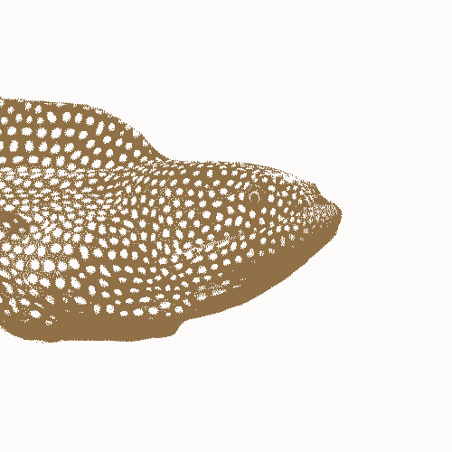

# pkgdown 

# SENLM.

An R package for modelling ecological data that is sampled across environmental gradients.

For installation and usage details, please visit the package website:

  https://primer-e.github.io/senlm/
  
## Other non-linear modeling packages

  - [gnlm: Generalized Nonlinear Regression Models](https://cran.r-project.org/web/packages/gnlm/index.html)
  - [gamlss.nl: Fitting non linear parametric GAMLSS models](https://cran.r-project.org/web/packages/gamlss.nl/index.html)
  - [Stan](https://mc-stan.org/)

## Contributing

Before commiting changes run `devtools::check()` to build the package and check for many common problems. Also run `pkgdown::build_site()` in order to check that the package website can be built without errors.

Travis-CI will automatically run `devtools::check()`, rebuild the package website and analyse test coverage each time a commit is pushed to Github. 
However, it will only push changes to the `gh-pages` branch, so it's important that you run `devtools::check()` manually in order to update the package help pages and NAMESPACE.


You should read the following excellent books about developing R packages (both of which happen to be written by Hadley Wickham):

  - [R packages](http://r-pkgs.had.co.nz/)
  - [Advanced R](https://adv-r.hadley.nz/)
  
If you want to update the package's website, then read the [pkgdown documentation](https://pkgdown.r-lib.org/).

To build a PDF version of any vignette replace the line `output: rmarkdown::html_vignette` with the following:

```
output:
   pdf_document:
     latex_engine: xelatex
```

Use `devtools::build_manual()` to compile the package help pages into a PDF document.
