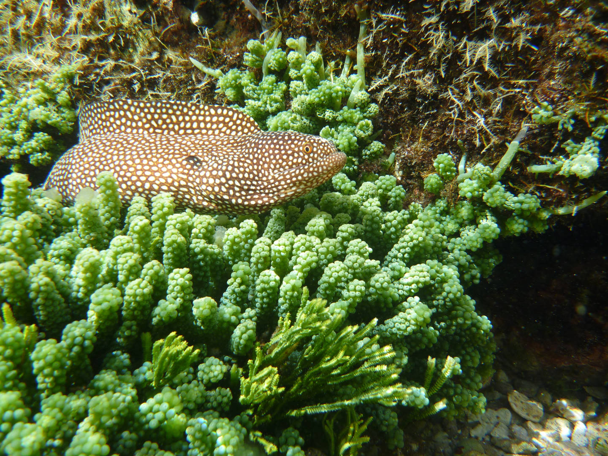

# SENLM

\ 

An R package for modelling ecological data that is sampled across environmental gradients.

See [Get Started](articles/senlm.html) for instructions on how to install and use the package.
